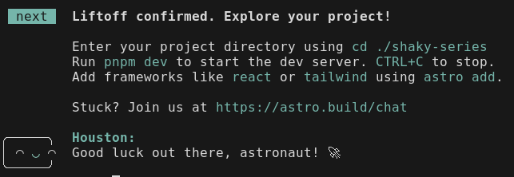
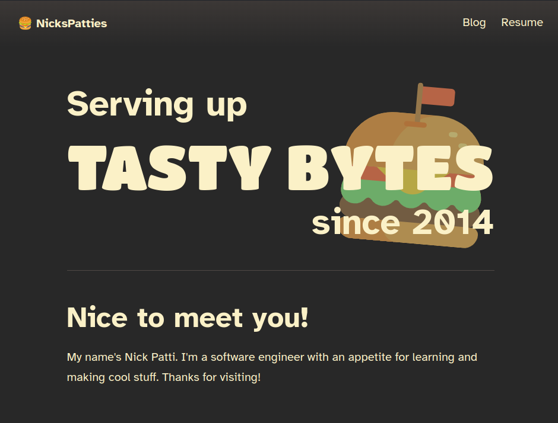

Hello, and thanks for visiting! This marks this site's first, official blog post.

I'd like to use this blog as a platform to share my software development process. It's an opportunity for me to show my abilities, and solidify my understanding of my own work. Perhaps, over time, we can learn together!

To start, let's talk about this website, my purpose for making it, and what it's made of.

# Goals

I've thought about some things that make a good technical blog. This site should make it easy for me to do the following things.

## To share my knowledge

- Make it easy for me to write and update things

I want to just write the article, but not have to worry about anything else.

- Make it easy to read the content

This is primarily accomplished with easy design and accessibility

- Make it easy to deploy my changes to the wider internet

I just like automation. I don't want to have to keep doing the same thing over and over again. Doing so will make me hate the process of writing, which I want to avoid.

## To share my projects

- Demonstrate to others my abilities

I want people to understand I know what I'm talking about, but that I'm willing to learn more. (This is the part that separates me from the others)

- Share my intent for these projects

I can ask other people to check out my site, go to events in person and have them look. At any point, my projects may be in a state that is not easy to use.

- Show off the things I like to create

I want to share what I've made, but also share my intent for projects that I'm currently making

So, I want this site to be a place where my content is easy to find, easy to read, and easy for me to show off. With this in mind, I lay out my requirements.

## Requirements

### Easy to write

I'm not the fastest writer, so something that makes it really easy for me to write articles with as little friction as possible is a great help.

Things that I need to configure, modify, and move each time I create a new article distracts me from the goal of writing articles. The more streamlined the process, the better.

I'll know I've done a good job if **writing an article takes about two days to complete at most**. Note this is not two whole days, but if I spend an hour or two for a couple of days, then I should be ready to publish something.

### Easy to read

There's no point in having a lot of content to share if it's difficult to read.

Using my site needs to be a pleasant experience. It needs to be **fast to load**, and **support all screen sizes**. It also needs to be accessible: **screen reader support** and **keyboard navigation** should work on my site.

I want this site to respect a reader's choice to **disable JavaScript**.

### Easy to share

Sharing a link to this site (or any site, really) is straightforward: copy the link and send it. This comes with the web.

But, if I post a link from this site elsewhere, such as a social media site or messaging app, I want to **show rich content** to the recipient, to show off what this site is all about!

# How?

With these requirements laid out, is there a tool out there that can make it really easy for me to build my own site and handle all of my content? Enter...

## Static Site Generators

Static Site Generators (SSGs) are programs that take a text files and some templates as input, and smash them together to create a collection of web pages. Once these web pages are built, they can be uploaded to a web server, and thus, a website for all to see.

Typically, SSGs support [Markdown](https://en.wikipedia.org/wiki/Markdown) text files, which are easy to read and write. I can write my files in any text editor I want, and I don't have to write complex HTML tags to format text. Since I've been using Markdown to write my notes lately, this helps a lot!

Once the web pages were built, the quickest way to get them on a web server was to deploy them to something like [GitHub Pages](https://pages.github.com/). This meant I didn't have to configure my own domain to host and share my site as quickly as possible.

[Jamstack.org's site generator list](https://jamstack.org/generators/) was a great resource for finding SSGs to try. After exploring some options, including Hugo, Hexo, and NextJS, I found something that caught my eye.

## Enter _Astro_

As far as SSGs go, I had the most pleasant experience working with this one! There was support for features that I wanted now, and perhaps in the future as the site starts to grow.

### Pros

Here's why I liked Astro:

- Astro does not generate JS by default!
- Interactive tutorials and friendly documentation ease the on-boarding process.
- I can create layouts with HTML, React, Vue, and Svelte components!

### Cons

There were some hiccups, though.

- There's no command line interface for creating new content automatically.

This was something I missed when I was trying out Hugo. If I wanted to create a new article or post, I could just use a command to generate all of my required files and start writing.

- Auto-formatting is provided by Prettier by default, which is very slow.

Compared to other formatting software, such as Biome, Prettier is very sluggish, and forces me to slow down when I save. Although it's only about a half-second, I find I lose momentum when writing something and I have to save.

Despite those shortcomings, Astro was very appealing to me. I committed to my choice, and got started.

# Building the site

I started with [Astro's official blog template](https://github.com/withastro/astro/tree/main/examples/blog) and went from there. I did this for a few reasons:

- Accessibility features were built in out of the box
- Already had a blog data type defined
- Already had basic layouts for a blog page

_Talk about how I built the site with the blog template. Include commands._

The command to build the template was very simple. I modified the command from their documentation and ran this:

```sh
pnpm create astro@latest --template blog
```

The prompts were very straightforward. Once the project was created, I was wished good luck, and proceeded with development.



_Thanks, Houston!_

After modifying some content in the template, here's what I came up with.


This was ok, but I didn't love it. There were some things I wanted to add.

## Changing the theme

I wanted this site to closely match the color scheme of my development environment. I figured that would be a fun way to show others how I work.

Here's what I did

- Create css variables for all the colors in the site
- Assigned the color variables to different values based on whether the user prefers light mode



Currently, I'm using the [Gruvbox color theme](https://github.com/morhetz/gruvbox?tab=readme-ov-file). The dark theme does not produce a lot of light-bleed in the characters when in a dark room, and the light mode does not burn my eyes out.


I added a light mode, too, if that's what users prefer. I enjoy light themes with a sepia tone in the background, which does a great job of reducing strain on my eyes.

### Code syntax highlighting

Code syntax highlighting was also a thought. In the default theme, the code blocks were dark, but I did not want that to be the case. If the user wants to look at a light screen, they should get what they want. Likewise, if the user wants a dark screen, then the code blocks should not blast their eyes with light.

I took care of this by using the built-in "prism" syntax highlighting option. This allowed me to style my code with CSS in an easier way.

## Mobile navigation

These improvements not only apply to mobile devices, but also support screen zoom of up to 500%.

The default blog theme did not support a good mobile view in the navigation bar very well.


I made some modification to support this.

- Only have the blog and resume links in the nav bar
- Remove any links from the center of the nav
- Change the content of the title on the left side of the page

Now, instead of the nav wrapping terribly, the nav is much better to look at.


Plus, if the screen is skinnier, I just shorten the title of the site


## Improved blog cards

When displaying blog content, I preferred a more horizontal layout rather than a vertical layout. This allows me to fit more articles on a page, while allowing more room to add additional information in the future


I decided to change the orientation of the cards, and add some more styles to clean up the look, and make it more interactive on focus.


## Updated meta tags

Meta tags are read by other sites to create cards that make it easy to display what you're doing on other sites. By posting them on their page. Here are some examples from Discord.


After updating some of the provided tags, the social links look much better.


# Conclusion

I'm confident that Astro was a good choice. We'll see how well it satisfies my needs as I continue to use my site.

I've satisfied my requirements for now

- I can write articles really easily with Markdown
- I made my content easy to read with the improvements I made to the base blog theme
- I made it easy to share my site with the content

However, there are some ways I can improve on this site to permit this site to

## Next steps

- Internationalization would be a great way to expand the audience of this site. The knowledge that is presented should not be restricted by language.
- Monitoring access metrics
  - This will prevent me from needing to look at information from social media sites to get a sense for how many people are reading my articles.
- Automatically sharing posts on different platforms
  - I would love to post these articles on my accounts for social media, and I'm sure I can figure out how to do that
- Adding some scripts to simplify the process of creating new articles

This concludes the quick overview of my personal site! If you'd like to follow along with its development, or explore the code, you may find it here in [the GitHub repository](https://github.com/NicksPatties/portfolio-site).
