Today I'll talk about the technical details of this site.

# Starting from the blog template

I started with [Astro's official blog template](https://github.com/withastro/astro/tree/main/examples/blog) and went from there. I did this for a few reasons:

- Accessibility features were built in out of the box.
- The layouts and types for blogs were already defined.

Using this template gets me most of the way to completing the goals I mentioned earlier! The command to build the template was very simple. I modified the command from their documentation and ran this:

```sh
pnpm create astro@latest --template blog
```

The prompts were very straightforward. Once the project was created, I was wished good luck, and proceeded with development.

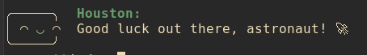

_Thanks, Houston!_

After modifying some content in the template, here's what I came up with.

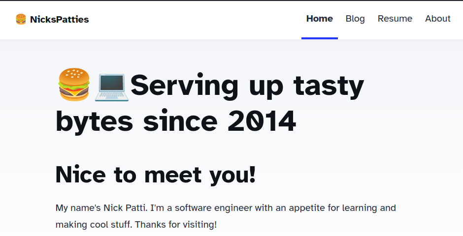

This was ok, but I didn't love it. Here's some things I did to make it look the way I wanted.

## Changing the theme

I wanted this site to closely match the color scheme of my development environment. I figured that would be a fun way to show others how I work.

Here's what I did

- Create css variables for all the colors in the site
- Assigned the color variables to different values based on whether the user prefers light mode

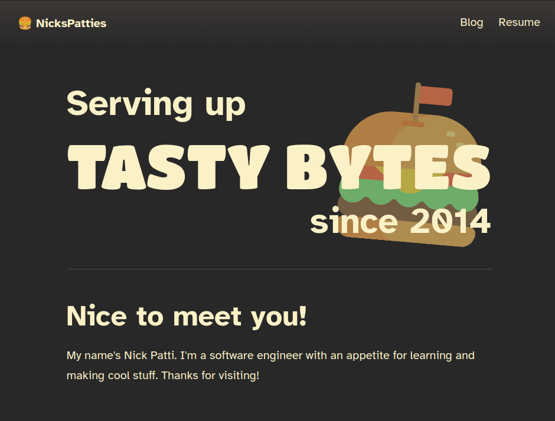

Currently, I'm using the [Gruvbox color theme](https://github.com/morhetz/gruvbox?tab=readme-ov-file). The dark theme does not produce a lot of light-bleed in the characters when in a dark room, and the light mode does not burn my eyes out.

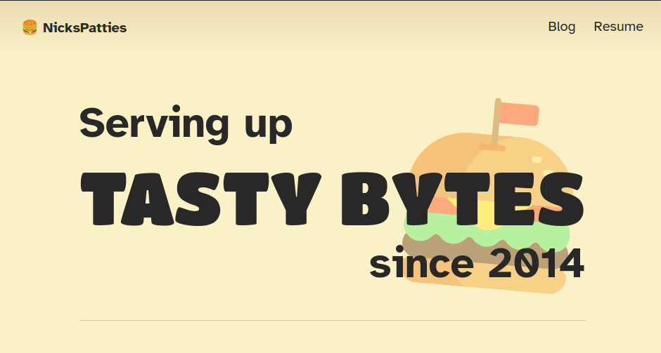

I added a light mode, too, if that's what users prefer. I enjoy light themes with a sepia tone in the background, which does a great job of reducing strain on my eyes.

### Code syntax highlighting

Code syntax highlighting was also a thought. In the default theme, the code blocks were dark, but I did not want that to be the case. If the user wants to look at a light screen, they should get what they want. Likewise, if the user wants a dark screen, then the code blocks should not blast their eyes with light.

I took care of this by using the built-in "prism" syntax highlighting option. This allowed me to style my code with CSS in an easier way.

Here's an example of the code that is used to power the site! This is the configuration of a blog post.

```typescript
import { defineCollection, z } from "astro:content";

const blog = defineCollection({
  type: "content",
  // Type-check frontmatter using a schema
  schema: z.object({
    title: z.string(),
    description: z.string(),
    // Transform string to Date object
    pubDate: z.coerce.date(),
    updatedDate: z.coerce.date().optional(),
    heroImage: z.string().optional(),
    published: z.boolean().default(false),
  }),
});
```

## Mobile navigation

These improvements not only apply to mobile devices, but also support screen zoom of up to 500%.

The default blog theme did not support a good mobile view in the navigation bar very well.

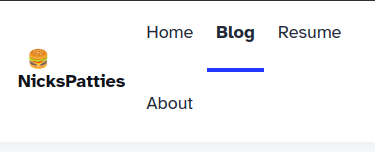

I made some modification to support this.

- Only have the blog and resume links in the nav bar
- Remove any links from the center of the nav
- Change the content of the title on the left side of the page

Now, instead of the nav wrapping terribly, the nav is much better to look at.

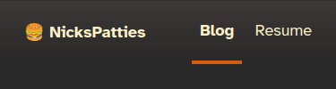

Plus, if the screen is skinnier, I just shorten the title of the site

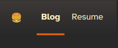

## Improved blog cards

When displaying blog content, I preferred a more horizontal layout rather than a vertical layout. This allows me to fit more articles on a page, while allowing more room to add additional information in the future

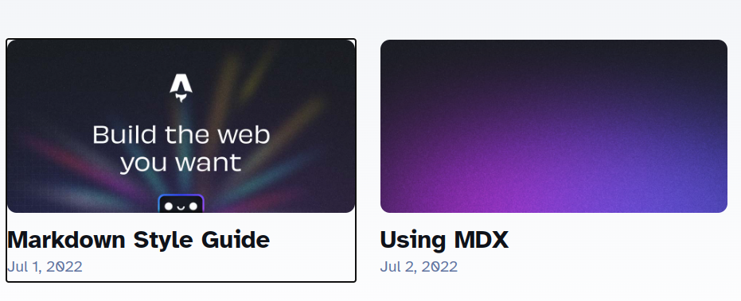

I decided to change the orientation of the cards, and add some more styles to clean up the look, and make it more interactive on focus.

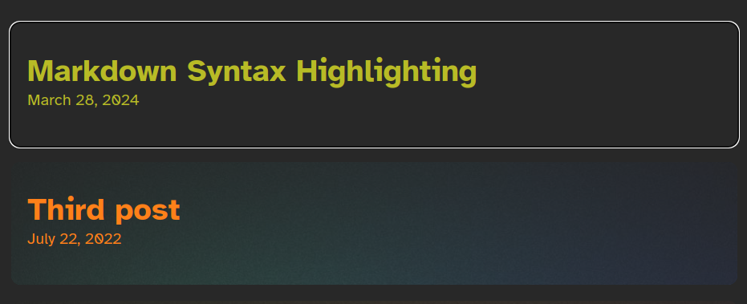

## Updated meta tags

Meta tags are read by other sites to create cards that make it easy to display what you're doing on other sites. By posting them on their page. Here are some examples from Discord.

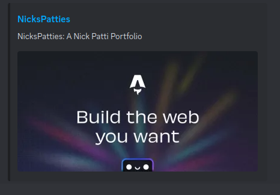

After updating some of the provided tags, the social links look much better.

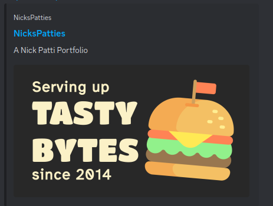

# Conclusion

I'm confident that Astro was a good choice. We'll see how well it satisfies my needs as I continue to use my site.

I've satisfied my requirements for now

- I can write articles really easily with Markdown
- I made my content easy to read with the improvements I made to the base blog theme
- I made it easy to share my site with the content

However, there are some ways I can improve on this site to permit this site to

## Next steps

- Internationalization would be a great way to expand the audience of this site. The knowledge that is presented should not be restricted by language.
- Monitoring access metrics
  - This will prevent me from needing to look at information from social media sites to get a sense for how many people are reading my articles.
- Automatically sharing posts on different platforms
  - I would love to post these articles on my accounts for social media, and I'm sure I can figure out how to do that
- Adding some scripts to simplify the process of creating new articles

This concludes the quick overview of my personal site! If you'd like to follow along with its development, or explore the code, you may find it here in [the GitHub repository](https://github.com/NicksPatties/portfolio-site).
